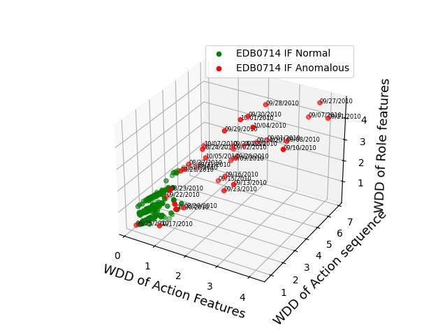
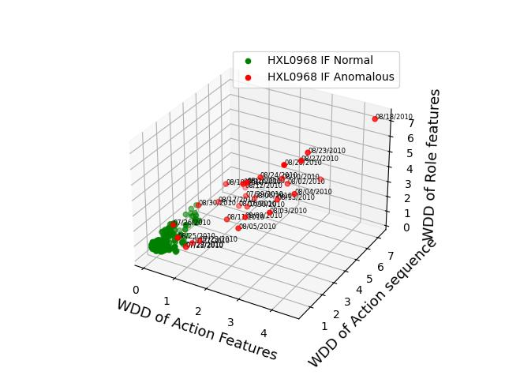

# User-and-Entity-Behavior-Analytics-UEBA
User and Entity Behavior Analytics by deep learning.  
Detecting users anomalous behaviors from users' daily records. 

内部威胁检测
## Details
All data were extracted from **CERT/R4.2** &nbsp;(*ftp://ftp.sei.cmu.edu/pub/cert-data*)

**Data**: data for detection.  

## Changelog since original branch:
- Kept User Data configurable
- Added Unsupervised learning for labelling Data instead of assuming that users start behaving anomalously after certain time
- Added code for sampling CERT Dataset in order to see analytics of other user as well
- Streamlined Step 3 and 4 (Action features and sequence models) for every user configured
- Added scripts for running entire UEBA pipeline.
- Added requirements.txt and made code compatable with latest version of python, tensorflow, pandas, numpy, matplotlib
- Re Implemented Action and Sequence Feature Models using ConvLSTM2D as per paper
- Added more context to Readme.

## Dependent Libraries
- python greater than 3.10-64-bit
- numpy
- pandas
- scikit-learn
- tensorflow==2.15.0
- matplotlib
- pickle

## Usage
- The repository already contains CERT data extracted for some users, details of which are in Data/config.json, however you can create your own config and execute 0-Sample_Data_from_CERT.py separately
- Run run.bat or run.sh which automatically runs in following steps: 
   - 0-Sample_Data_from_CERT.py : Extracts Data from CERT dataset as per user configuration in Data/config.json (Some sample data already exists in this repo, so you may skip this).
   - 1-FeatureExtraction.py : Creates features from sampled data from CERT per user and merge the data from multiiple sensors.
   - 2-Training_Data_Generating.py : Splits the data generated in above into Training and Testing with a split of 0.7.
   - 3-Action_Sequence_Training.py : Trains a ConvLSTM2D model for learning and predicting the actions features for the next day given input data of previous 4 days.
   - 4-Static_Feature_Training.py : Trains a ConvLSTM2D model for learning and predicting the static features for the next day given input data of previous 4 days.
   - 5-Role-Feature_and_Mix.py : Calculates deviations in Role features and concatenates these with outputs of above two models.
   - 6-Unsupervised_Isolation_Forest_Training_and_Metrics.py : In a 3D space of WDD (Weighted Deviation Degree) for Action Sequence Model v/s WDD for Action Features Model v/s WDD in Role Features this performs Outlier or Anomaly Detection for points (corresponding to activity in one day) using Isolation Forest Algorithm. At this point in real world scenario Security Analyst can review for true positives and relabel the data. Below two graphs are generated by this script.
   - 7-Mix_Users_Data_for_MLP.py : At this point we proceed to train an MLP (multi layer perceptron) (supervised learning) to replace above unsupervised learning to get more precise anomaly outputs based on wider observation of overall user's data and analyst's relabeled inputs. This script will merge all user group's data and split into train test set to train MLP
   - 8-Supervised_MLP_Training_and_Metrics.py : In this script actual MLP is trained and we will get more relevant anomalies for user behavior.
   
- To reproduce old environment as in original branch, open up anaconda prompt and create old python environment "conda create --name myenv python=3.6", activate and execute "pip install -r requirements_old.txt"

- 

- *Anomalies detected in space of WDD for Action Sequence Model v/s WDD for Action Features Model v/s WDD in Role Features for user EDB0714 using Isolation Forest*

- 

- *Anomalies detected in space of WDD for Action Sequence Model v/s WDD for Action Features Model v/s WDD in Role Features for user HXL0968 using Isolation Forest*

*The provided features and deep learning models in this project are very simple samples, and you can add or create your own features and models based on this project.*

## Cite this work
This project is a part of our work that has been published in the ACM/IMS Transactions on Data Science. You can cite this work in your researches. 

ACM/IMS Transactions on Data Science, Volume 1, Issue 3 September 2020, Article No.: 16, pp 1–19 https://doi.org/10.1145/3374749

[Paper Link](https://dl.acm.org/doi/10.1145/3374749)
